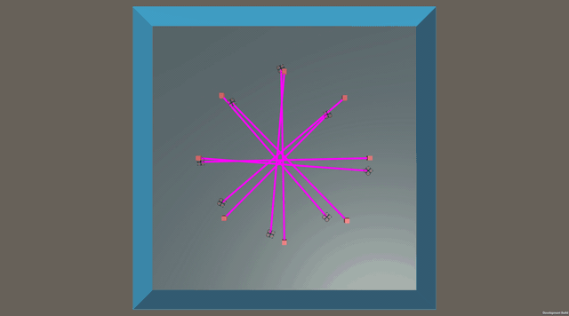

# DroneColony
This repository contains code for the [Multi-Agent Collision Avoidance via Deep Reinforcement Learning.](https://sites.google.com/view/dronecolony/startseite)

#### Clone:
`git clone git@github.com:ramziourari/droneColony.git`

#### Install dependencies:
`conda env create -f swarm.yml`
if you need conda see [installation guideline](https://docs.continuum.io/anaconda/install/)
### Server clients:
* first open a terminal with **dronecolony** as root
* `./run_server.sh`
* open a new terminal with **dronecolony** as root too
* `./run_client.sh`
training should start.
### visualization
to visualize results run `./visualize_res.sh`  you may need to change `cd /home/student` to match your setup.

the example runs an experiment defined in [experiments/PPO_AtoB.yaml](https://gitlab.com/ramzi_ourari/dronecolony/-/blob/master/experiments/PPO_AtoB.yaml) to run your own experiment create a yaml file 
and change the last line in **run_server.sh** and **run_client.sh**
### Hyperparameters Tuning:
#### Local:
run `python tuning.py` for hyperparameters tuning with [population based training (PBT)](https://docs.ray.io/en/master/tune/tutorials/tune-advanced-tutorial.html). Results can be found under **/results**
run:\
`tensorboard --logdir results` for visualization.
#### Cluster:
* connect to cluster:\
`ssh <tu-id>@lcluster6.hrz.tu-darmstadt.de`\
(or any other node.. see [lcluster-nodes](https://www.hhlr.tu-darmstadt.de/hhlr/betrieb/hardware_hlr/aktueller_status_1/statisch.de.jsp))

* copy directory from local to remote:\
 `scp -r localDir <tu-id>@lcluster6.hrz.tu-darmstadt.de:~/remoteDir`

* copy from remote to local:\
 `scp -r <tu-id>@lcluster6.hrz.tu-darmstadt.de:~/remoteDir ~/localDir`

see [run_ppo.sh](https://gitlab.com/ramzi_ourari/dronecolony/-/blob/master/run_scripts/run_ppo.sh) for an example of a job script\
the example runs (PBT) with PPO on the AtoB game. results can be found in **dronecolony/results**

submit a job with:\
`sbatch run_scripts\run_ppo.sh`

### Unity Project
Environments are created with unity see [unity-project](https://gitlab.com/ramzi_ourari/dronecolony/-/tree/master/unity-project) for an example on how to create one. you will need the [unity-hub](https://docs.unity3d.com/Manual/GettingStartedInstallingHub.html).

### Misc
#### save trajectories
* [uncomment L131 to 137](https://gitlab.com/ramzi_ourari/dronecolony/-/blob/master/ppo_client.py#L131)
* re-run `./run_client.sh` with **dronecolony** as root
* you now have a file **traj.h5** with the trajectories.
* see this [notebook](https://gitlab.com/ramzi_ourari/dronecolony/-/blob/master/plot_results.ipynb) for an example on how to plot.
#### save weights
* [uncomment L169](https://gitlab.com/ramzi_ourari/dronecolony/-/blob/master/ppo_server.py#L169)
* re-run `./run_server.sh` with **dronecolony** as root
* you now have a file **weights.txt** with the policy's weights.
* the weights can be used for inference on the drones see [nn.c](https://gitlab.com/ramzi_ourari/dronecolony/-/blob/master/crazyflie_collision_avoidance/nn.c) for an example.
#### useful links
* [unity ml agents examples](https://github.com/Unity-Technologies/ml-agents)
* [sim to real](https://github.com/TaoChenOSU/quad_nn)
* [ray community examples](https://docs.ray.io/en/latest/rllib-examples.html#community-examples)
* [unity3d with ray](https://github.com/ray-project/ray/blob/master/rllib/examples/unity3d_env_local.py)
* [unity3d server-client](https://github.com/ray-project/ray/tree/master/rllib/examples/serving)
